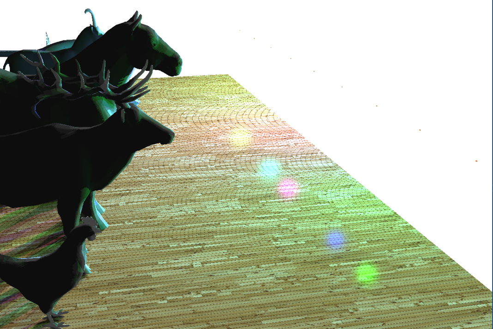

# Course-Project_Graphics-Programming

  

This repository contains code that I submitted as term project for **430.638 Graphics Programming** course at SNU in 2019. This code implements following computer graphics rendering techniques with OpenGL.

## OBJ Loader

This code implements simple OBJ file loader. With this loader, I loaded several low-poly animal models that are free-to-use.

  

## Textures

This code implements simple texture loader. I applied textures to the floor and the wall in the background.

  

## Lights

This code implements simple point and linear area light. There are 9 point lights and a single linear light in the scene. User can toggle those light using keyboard inputs.

  
  

## Shadows

This code implements real time shadow map. However, this shadow map follows rules of directional lights, instead of precise point or area lights.

  
  

## Ambient Occlusion

This code implements simple ambient occlusion. This task is conducted by two-pass algorithm. In the first pass, each pixel's color and depth values are stored in texture. In the second pass, random vectors are added to each pixel and the values are compared with depth values from the first pass to determine occlusion factor. Instead of using hemisphere at the vertices, this code uses full sphere and it results in rather inaccurate ambient occlusion. 

  
  

## Deferred Rendering

This code imiplements simple deferred rendering. This task is conducted by two-pass algorithm. In the first pass, each pixel's 1) coordinates in viewing space, 2) normal vector in viewing space, 3) color(diffuse, specular), 4) depth values are computed and stored in a texture. In the second pass, the information from the first pass is combined with lights and shadow maps to render the entire scene.

  
  

